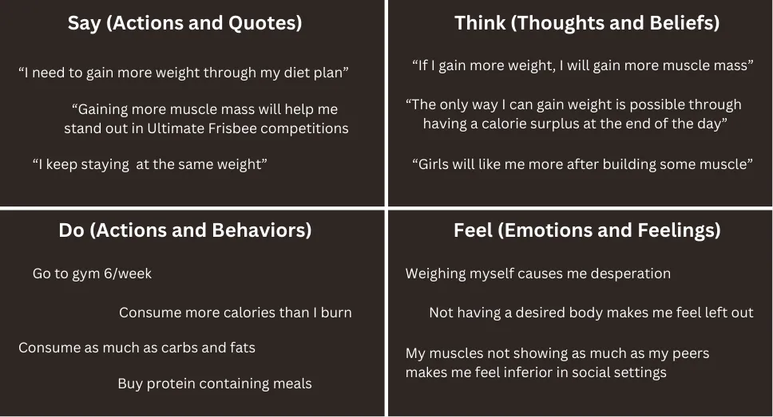
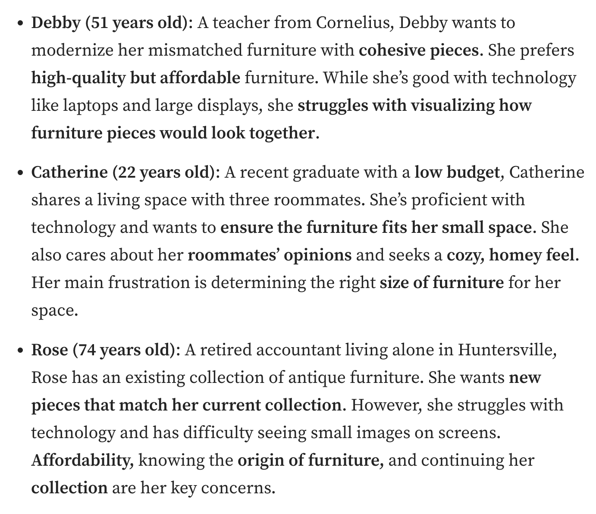
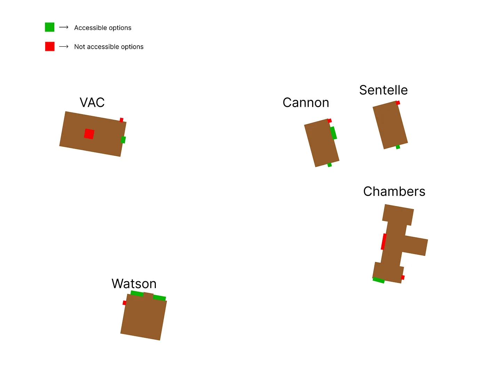
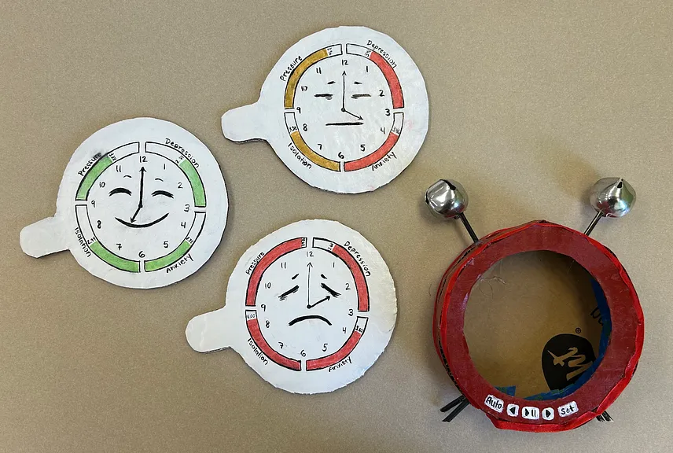

# **Design Manifesto**  
## *Reflections on my HCI Journey*  

---

### **Introduction**  

Nowadays, smart technology has expanded into every corner of our lives. From AI models that mimic human creativity to tools that optimize daily tasks, technology now shapes how we work, live, and connect. As someone who has spent time building software projects to help others, this class gave me a rare opportunity to slow down and ask: **Why are we designing the way we do? And how can we design better for people?**  

Throughout this course, I’ve reflected on a ton of my previous software projects and gained deeper insights into my what I am currently trying to achieve with a direct to user technology startup, **GrotN** which also tries to simplify processes through the convenience of technology. I also couldn’t help but think back on a book I read during high school, Otto Scharmer’s *Theory U*. This was a book that highlights the power of design thinking to create meaningful solutions through putting user at the center. Scharmer’s work reminds me that the design process is less about jumping to solutions and more about **seeing, sensing, and iterating** to create tools that empower people. These were extremely similar certain findings I had from the HCI class.   

The journey through Human-Computer Interaction (HCI) has certainly shifted how I view design in certain aspects. This design manifesto reflects my growth and focuses on five key principles that now represents how I see a design process:  

1. Start with empathy  
2. Define problems clearly  
3. Iterate relentlessly  
4. Design inclusively  
5. Prototype for the real world  

Each principle, shaped by projects, reflections, and failures, represents how design can go beyond aesthetics and functionality to become **human-centered, inclusive, and impactful**. I will be going over these projects, reflections and results for each of these steps that we went this Fall!

---

### **Start with Empathy**  
The design process begins with empathy. As designers, we often assume we know what users want. But real design requires us to step into their shoes, listen to their struggles, and see the world from their perspective. This idea came alive during the **Needfinding Exercise**, where I explored the challenges college students face in aligning their fitness and diet goals.  

For this project, I interviewed three people: Patrick, Oktay, and Anil. All these college students had fitness goals but very different relationships with diet and accountability. Patrick struggled to eat in a caloric surplus due to external factors like sleep and social activities. Oktay emphasized the role of social accountability, while Anil highlighted the importance of consistency in diet plans.  

  

To synthesize their stories, I created an **empathy map** that visualized what users think, feel, say, and do. This map helped me uncover insights that would not be able to generate on my own. Here were some outcomes that I had that were actual user stories and problems:  

- **Keeping track of calories is harder than people think**—it’s time-consuming and stressful.  
- **Accountability matters**—having a “fitness buddy” makes sticking to a plan much easier.  
- **Consistency brings comfort**—users want a routine they can stick to without feeling overwhelmed.  

This exercise taught me that empathy isn’t just about listening, it’s about seeing beyond the surface. By understanding my users’ struggles and motivations, I was able to have a better idea of what to design for the future steps of the process just because I knew what the users were going through and exactly what they would and they would not like.  

---

### **Define Problems Clearly**  
Once you understand the user, the next step is to define the problem with clarity. As **Albert Einstein** said, “If I had an hour to solve a problem, I’d spend 55 minutes thinking about the problem and 5 minutes thinking about solutions.” This was a quote that highly resonated with my semester. 

I see hackathons as an incredibly accelerated version of a design process with more emphasize on the **hacking** part. However, the most significant step in all the hackathons I attended this year was coming up with a real problem to solve. This was the most important step to success in almost all the projects I worked on, as also supported by the biggest startup school in the world, YCombinator: 
> Make something people want

A well-defined problem makes solutions much easier to find.

This principle became clear in the **Knotty & Board** project, where we redesigned a website to improve usability. To define the problem, my team and I created **user personas** that represented different types of users:  

  

- A student who values budget-friendly, space-saving solutions  
- An older user who struggles with technology and values simplicity  

Personas allowed us to view the problem from multiple lenses. Instead of jumping to solutions, we took time to analyze:  

- What are the pain points users face?  
- What outcomes do they value most?  
- How can we balance their needs within a single interface?  

By defining the problem clearly, we realized our redesign wasn’t just about improving visuals. Rather, it was more so about creating a tool that addressed diverse user goals on diverse technological devices based on their demographics too. 

Similarly, this principle also shaped my approach to prototyping the **fitness-diet tool**, the app I was building based on my findings from the previous emphathy section. Here, I had to narrow the problem to tracking calories in a simple, non-intrusive way focusing on the empathy map and user personas from the previous exercise.

---

### **Iterate Relentlessly**  
Design is almost never perfect on the first try. It’s an iterative feedback loop process of testing, failing, learning, and improving. One of the most valuable lessons I learned in this class was to taking feedback from as many people as possible as almost everybody has something to add. In this context, either embracing failure or not seeing it as an actual failure but a step in the design process also helped massively in the improvmenet steps.   

This principle was central to multiple projects (maybe almost all), including but not limited to the **fitness-diet tool** and the **Design Sprint 2 visualization**.  

For the fitness-diet tool, I started with basic sketches based on user insights. I shared these prototypes with classmates, gathered feedback, and improved the design:  

- **Initial problem:** Users found calorie tracking too manual and stressful.  
- **Iteration:** Simplified the interface to prioritize calorie surplus as the main KPI while offering easy input for food and exercise.

Similarly, in Design Sprint 2, me and my team visualized data around college students’ mental health. Early versions were cluttered and hard to interpret. By gathering feedback and iterating, we refined the visuals, introducing opacity-based scatterplots and interactive elements to make the visualization and their interpretations more intuitive.  

The **feedback loop** which mostly consists of *test, fail, improve* makes all the difference. Through iteration, I learned that design is never exactly “finished.” It evolves through continuous dialogue with users and stakeholders.

---

### **Design Inclusively**  
Inclusivity is at the heart of good design. A tool that excludes people, whether it is due to physical barriers, cognitive challenges, or other factorsm, fails the main purpose of working for **humans**. This realization hit me during the **Campus Accessibility Project**, where I spent 24 hours navigating Davidson College as someone with mobility impairments. The assignment even made me realize new spots, paths, or entrances on campus and has impacted my way of walking around since then. 

I focused on five buildings: VAC, Cannon, Sentelle, Watson, and Chambers. The experience was eye-opening. For example:

- **Positive aspects:** Many buildings had accessible entrances and powered doors.  
- **Negative aspects:** Some entrances were hidden, lacked powered doors, or required navigating stairs.  

  

The reflection made me more aware of how **small design choices**, like installing powered doors or removing stairs, can transform accessibility for everyone. 

I also tried to carry this lesson into other projects, like the **3D VR ball shooting game**, where we designed immersive experiences that engaged multiple senses. We wanted to make sure to follow the basic accessbility guidelines to make sure everyone can access the game, even without a VR headset at their expense.  

<iframe width="560" height="315" src="../src/assets/images/Demo.MOV" frameborder="0" allowfullscreen></iframe>

Inclusive design isn’t just for people with disabilities. It is an essential thought process that benefits everyone with many different cases. A slight thought by the designer put onto the design can create life-changing experience for thousands of users.

---

### **Prototype for the Real World**  
The final step is to build prototypes that work in real-world settings. Prototypes aren’t about perfection. They are meant for testing ideas quickly and learning from them. In essence **iterating**.  

The **3D VR ball shooting game** we designed is a perfect example. Using sight and rotation based controls, we built an immersive experience that engaged the user’s head movement, vision, and hearing. The simplicity of the design made the game intuitive, showing that good prototypes don’t have to be complicated. While building this game, we always made sure to let our friends play the game and obtain constant feedback on our prototype

Similarly, in the **Re-design and Extend assignment**, we focused on simplifying user interactions. By removing unnecessary elements and improving navigation, we created tools and prototypes that users could understand immediately. By designing both our bar charts and clock designs from my [Design Sprint 2](https://medium.com/@khnguyen_23014/designing-for-understanding-the-impact-of-exercise-sleep-and-gpa-on-mental-health-among-u-s-4378ce063dc8), we aimed to go for a simple and interactive design for the users. 

Both projects reinforced a key lesson: prototypes should **engage multiple senses** and prioritize **simplicity**. The goal isn’t to build something flashy. Instead, it’s to build something that users can interact with and understand effortlessly.

---

### **Conclusion**  
This had an effect on certain aspect of my perspective related to design and hows and whys of it. My focus has shifted from being a user of technology (and possibly even a builder of technology) to thinking deeply about **why and how** it’s built. Design isn’t about adding features for the sake of it. It’s about creating tools that solve real problems and empower people. 

Otto Scharmer’s *Theory U* reminds us that design is a journey of **listening, reflecting, and co-creating**. As I continue my work with my startup GrotN and beyond, I will carry forward the principles I’ve learned throughout the design processes of this class:

- Start with empathy.  
- Define problems clearly.  
- Iterate relentlessly.  
- Design inclusively.  
- Prototype for the real world.  

> “The ultimate aim of design is not to create for humans, but to create **with** humans.”  

Great design starts with understanding people. It ends with solutions that make life just a little bit better.  
